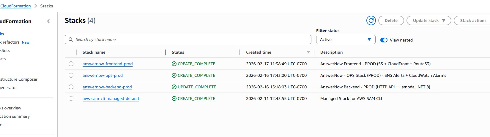
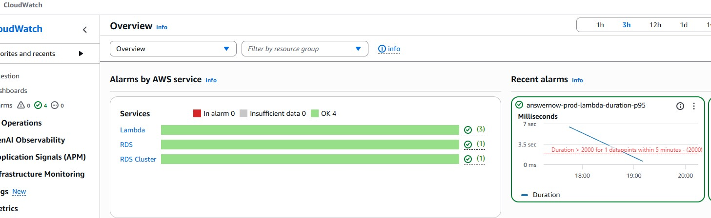
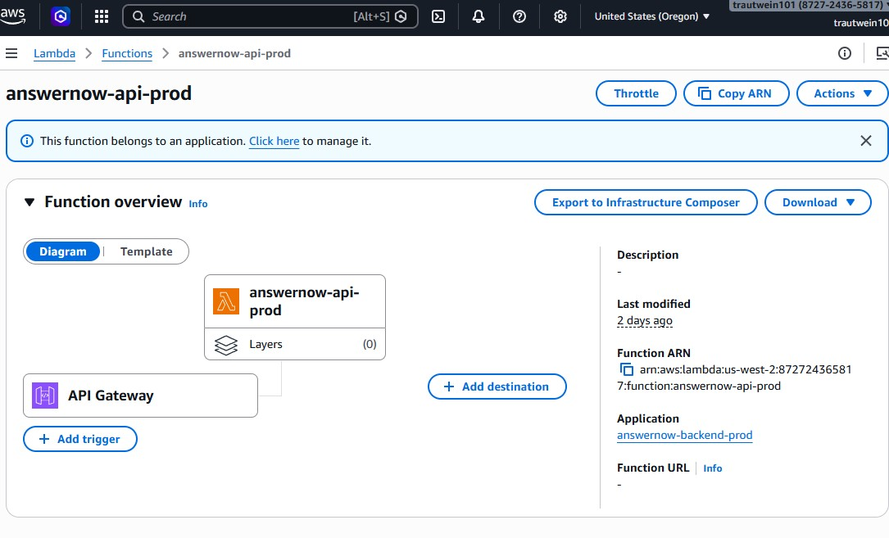
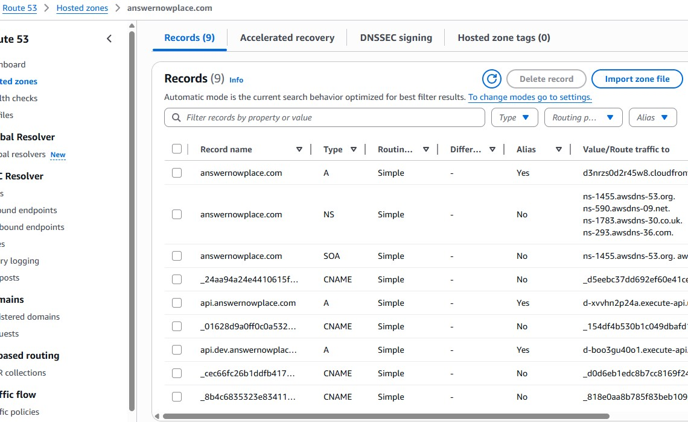
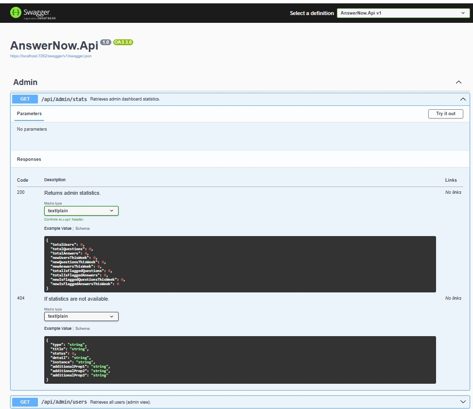

# AnswerNow Architecture

## Overview

AnswerNow is a full-stack Q&A platform built to demonstrate modern .NET backend architecture and production-style AWS serverless deployment.

Key goals:
- Clean layered architecture in .NET
- Environment-based configuration (DEV / QA / PROD)
- Infrastructure as Code (SAM + CloudFormation)
- Secure secret management
- Monitoring + alerting (CloudWatch + SNS + Budgets)
- Cost-conscious AWS design

---

## Architecture Diagram

---

The following screenshots demonstrate the deployed production environment and operational monitoring configuration.

## Infrastructure Snapshots

### CloudFormation Stacks

### CloudWatch Monitoring & Alarms

### Lambda Configuration

### Route53 DNS Configuration

### Live Swagger API (Custom Domain)

---

# High-Level Architecture

## Local Development

Angular SPA  
→ ASP.NET Core API (.NET 8)  
→ PostgreSQL (Docker)

Notes:
- Local secrets (JWT signing key, connection string) are provided via environment variables.
- Secrets are never committed to source control.
- EF Core migrations run against the local Docker database.

---

## AWS Deployment

CloudFront (Angular SPA)  
→ API Gateway (HTTP API)  
→ AWS Lambda (.NET 8)  
→ Amazon RDS PostgreSQL  

Secrets and configuration:
- Environment-specific settings are loaded via configuration layering.
- Sensitive values (JWT secret, DB connection string, database password) are stored in **AWS Secrets Manager**.
- Secrets are injected into Lambda as environment variables at deployment time.
- No sensitive values are stored in Git or hardcoded in templates.

Operations:
- CloudWatch alarms
- SNS notifications (email/SMS)
- AWS Budgets for cost alerts

---

# Stack Separation Strategy

The infrastructure is split into logical stacks to keep deployments clean and environments isolated.

## Frontend Stack
- S3 bucket (static hosting origin)
- CloudFront distribution
- ACM certificate (us-east-1)
- Route53 alias records

## Backend Stack
- API Gateway (HTTP API)
- Lambda function (.NET 8)
- IAM execution role (least privilege)
- Optional custom API domain (`api.*`)
- Route53 record + API mapping

## Database Stack
- RDS PostgreSQL
- DB subnet group
- Security group (restricted inbound access)

## Operations Stack
- CloudWatch alarms
- SNS topic/subscriptions
- AWS Budgets

---

# Application Architecture (Code Structure)

AnswerNow
│
├── AnswerNow.Api → Controllers, middleware, startup  
├── AnswerNow.Business → Application services  
├── AnswerNow.Data → Repositories and EF Core  
├── AnswerNow.Domain → Entities and models  
├── AnswerNow.Utilities → Shared utilities  
└── AnswerNow.Tests → Unit tests  

This enforces separation of concerns between API, business logic, and data access.

---

# Configuration Strategy

The application supports:
- DEV
- QA
- PROD

Configuration sources:
1) `appsettings.json`  
2) `appsettings.{Environment}.json`  
3) Environment variables  
4) AWS Secrets Manager (cloud environments)

Local:
- Environment variables are set using `setx` (Windows) or equivalent shell configuration.
- Docker-based PostgreSQL is used for development.

AWS:
- Lambda environment variables are defined in infrastructure templates.
- Secret values are stored in AWS Secrets Manager.
- IAM roles grant Lambda permission to access required secrets.

---

# Authentication Design

- JWT Bearer authentication
- Symmetric signing key
- Issuer and audience validation
- Zero clock skew
- Secret injected per environment

JWT configuration is suppressed during EF design-time operations to prevent tooling failures.

---

# Database Strategy

Local:
- PostgreSQL 16 via Docker
- EF Core migrations run against `answernow_dev`

Cloud:
- Amazon RDS PostgreSQL
- Security group restricts inbound traffic
- Lambda connects using a Secrets Manager–backed connection string

---

# Health Checks

| Endpoint | Purpose |
|----------|---------|
| /health/live | Liveness check |
| /health/ready | Readiness check (includes DB) |

Used for operational monitoring and environment verification.

---

# Monitoring & Alerts

- CloudWatch alarms (API/Lambda health indicators)
- SNS notifications for alerts
- AWS Budgets for cost monitoring
- Structured logging via console provider (CloudWatch Logs)

---

# Cost-Conscious Design Decisions

Examples of intentional tradeoffs:

- HTTP API instead of REST API
- Lambda instead of EC2
- Right-sized RDS for DEV/portfolio usage
- Secrets stored centrally (no secret sprawl)
- Budget alerts to prevent unexpected spend
- Stack separation to isolate environments

---

# Design Goals

This project demonstrates:

- Clean separation of concerns
- Secure secret management
- Serverless AWS deployment
- Real-world monitoring practices
- Infrastructure as Code
- Cost-aware engineering decisions