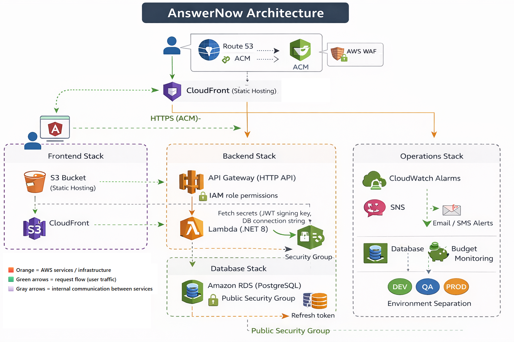
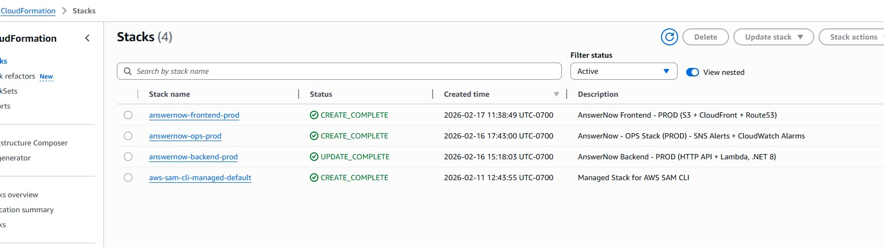
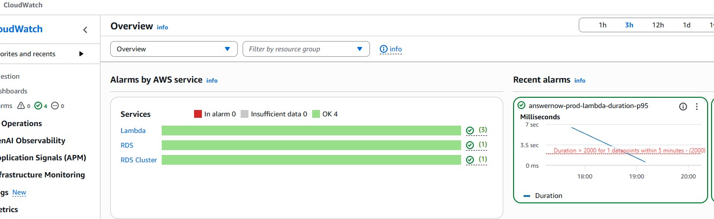
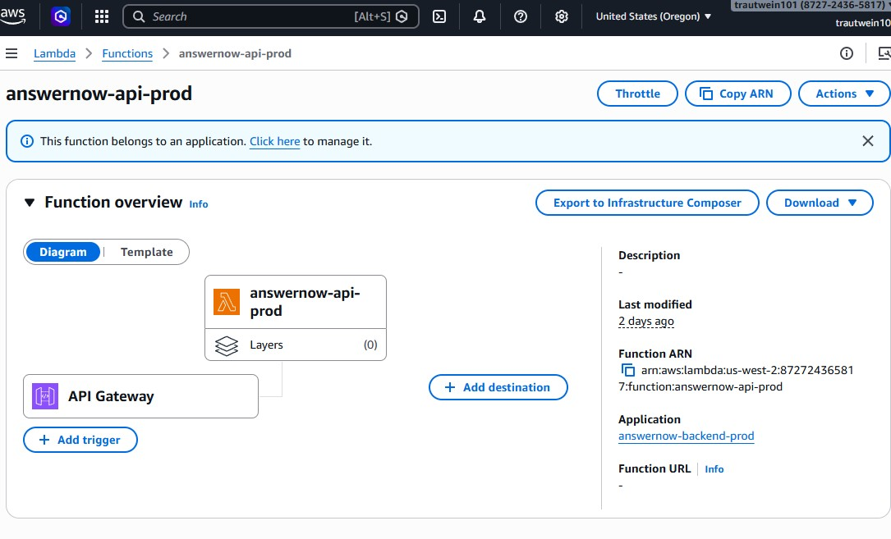
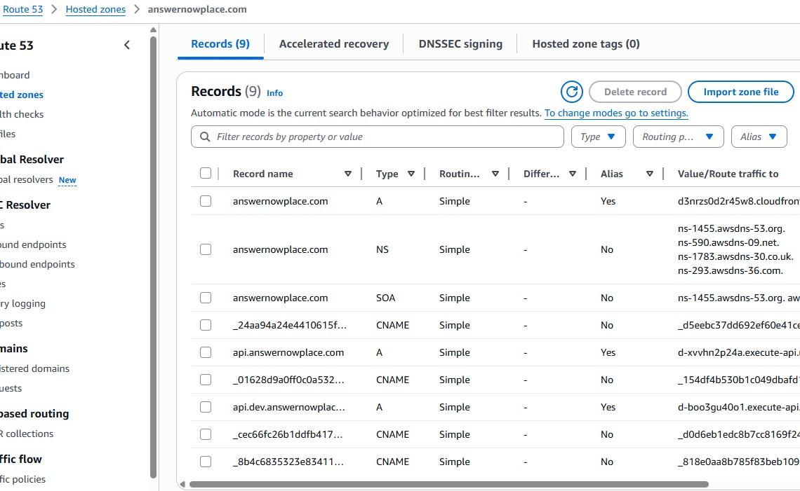
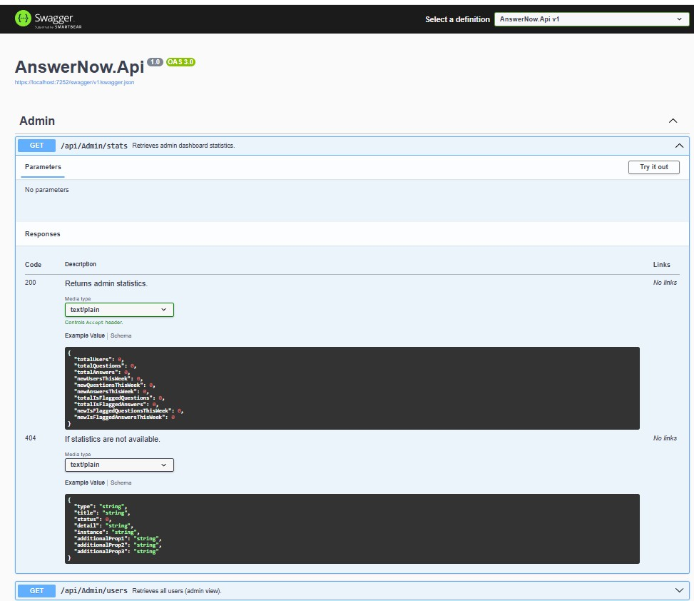
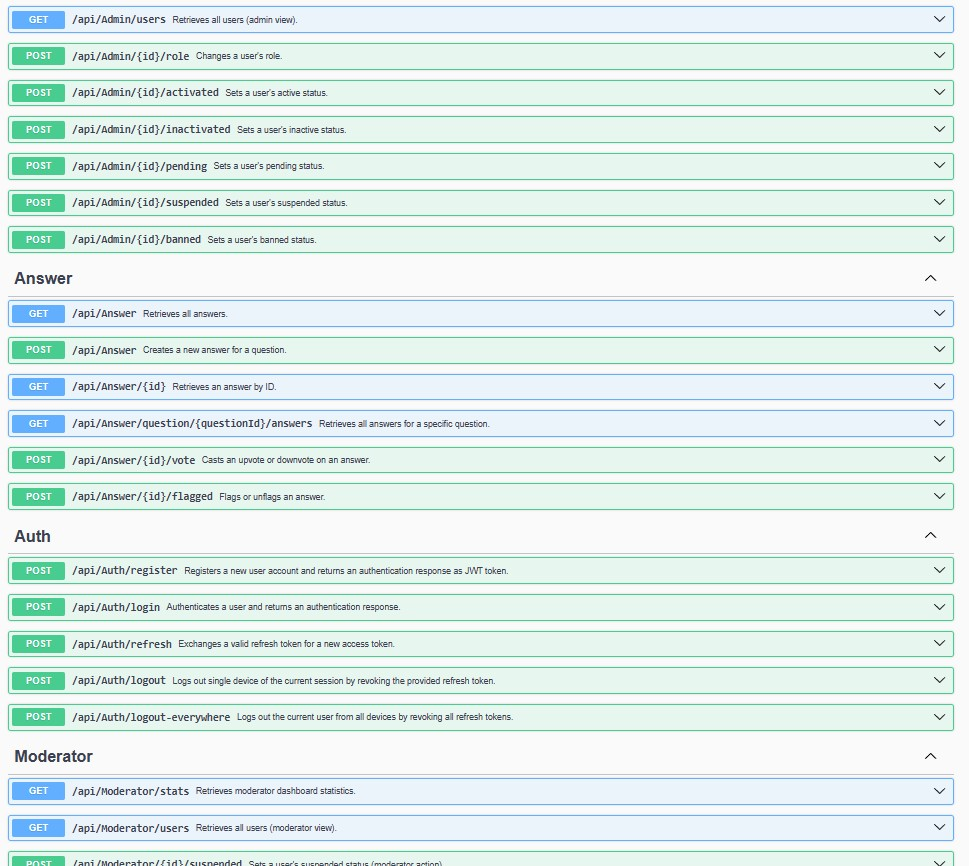

# AnswerNow Architecture

## Overview

AnswerNow is a full-stack Q&A platform built to demonstrate modern .NET backend architecture and production-style AWS serverless deployment.

Key goals:
- Clean layered architecture in .NET
- Environment-based configuration (DEV / QA / PROD)
- Infrastructure as Code (SAM + CloudFormation)
- Secure secret management
- Monitoring + alerting (CloudWatch + SNS + Budgets)
- Cost-conscious AWS design

---

## Architecture Diagram

## Request Flow
1. A user accesses the application through the custom domain configured in Route53.

2. Route53 directs traffic to CloudFront, which serves the Angular single-page application from an S3 static hosting bucket.

3. When the Angular frontend makes an API request, the request is routed through CloudFront to API Gateway.

4. API Gateway invokes the backend Lambda function running the .NET 8 Web API.

5. The ASP.NET middleware processes the request, authenticates the user using JWT authentication, and routes the request to the appropriate controller.

6. Controllers call business services, which interact with repositories using EF Core to query or update the PostgreSQL database hosted in Amazon RDS.

7. The response flows back through Lambda → API Gateway → CloudFront → the Angular client.

8. Operational monitoring is handled by CloudWatch alarms, which can trigger SNS notifications and budget alerts if thresholds are exceeded.

---

The following screenshots demonstrate the deployed production environment and operational monitoring configuration.

## Infrastructure Snapshots

### CloudFormation Stacks

### CloudWatch Monitoring & Alarms

### Lambda Configuration

### Route53 DNS Configuration

### Live Swagger API (Custom Domain 1 of 3 )

### Live Swagger API (Custom Domain 2 of 3 )

---

# High-Level Architecture

## Local Development

Angular SPA  
→ ASP.NET Core API (.NET 8)  
→ PostgreSQL (Docker)

Notes:
- Local secrets (JWT signing key, connection string) are provided via environment variables.
- Secrets are never committed to source control.
- EF Core migrations run against the local Docker database.

---

## AWS Deployment

CloudFront (Angular SPA)  
→ API Gateway (HTTP API)  
→ AWS Lambda (.NET 8)  
→ Amazon RDS PostgreSQL  

Secrets and configuration:
- Environment-specific settings are loaded via configuration layering.
- Sensitive values (JWT secret, DB connection string, database password) are stored in **AWS Secrets Manager**.
- Secrets are injected into Lambda as environment variables at deployment time.
- No sensitive values are stored in Git or hardcoded in templates.

Operations:
- CloudWatch alarms
- SNS notifications (email/SMS)
- AWS Budgets for cost alerts

---

# Stack Separation Strategy

The infrastructure is split into logical stacks to keep deployments clean and environments isolated.

## Frontend Stack
- S3 bucket (static hosting origin)
- CloudFront distribution
- ACM certificate (us-east-1)
- Route53 alias records

## Backend Stack
- API Gateway (HTTP API)
- Lambda function (.NET 8)
- IAM execution role (least privilege)
- Optional custom API domain (`api.*`)
- Route53 record + API mapping

## Database Stack
- RDS PostgreSQL
- DB subnet group
- Security group (restricted inbound access)

## Operations Stack
- CloudWatch alarms
- SNS topic/subscriptions
- AWS Budgets

---

# Application Architecture (Code Structure)

AnswerNow
│
├── AnswerNow.Api → Controllers, middleware, startup  
├── AnswerNow.Business → Application services  
├── AnswerNow.Data → Repositories and EF Core  
├── AnswerNow.Domain → Entities and models  
├── AnswerNow.Utilities → Shared utilities  
└── AnswerNow.Tests → Unit tests  

This enforces separation of concerns between API, business logic, and data access.

---

# Configuration Strategy

The application supports:
- DEV
- QA
- PROD

Configuration sources:
1) `appsettings.json`  
2) `appsettings.{Environment}.json`  
3) Environment variables  
4) AWS Secrets Manager (cloud environments)

Local:
- Environment variables are set using `setx` (Windows) or equivalent shell configuration.
- Docker-based PostgreSQL is used for development.

AWS:
- Lambda environment variables are defined in infrastructure templates.
- Secret values are stored in AWS Secrets Manager.
- IAM roles grant Lambda permission to access required secrets.

---

# Authentication Design

- JWT Bearer authentication
- Symmetric signing key
- Issuer and audience validation
- Zero clock skew
- Secret injected per environment

JWT configuration is suppressed during EF design-time operations to prevent tooling failures.

---

# Database Strategy

Local:
- PostgreSQL 16 via Docker
- EF Core migrations run against `answernow_dev`

Cloud:
- Amazon RDS PostgreSQL
- Security group restricts inbound traffic
- Lambda connects using a Secrets Manager–backed connection string

---

# Health Checks

| Endpoint | Purpose |
|----------|---------|
| /health/live | Liveness check |
| /health/ready | Readiness check (includes DB) |

Used for operational monitoring and environment verification.

---

# Monitoring & Alerts

- CloudWatch alarms (API/Lambda health indicators)
- SNS notifications for alerts
- AWS Budgets for cost monitoring
- Structured logging via console provider (CloudWatch Logs)

---

# Cost-Conscious Design Decisions

Examples of intentional tradeoffs:

- HTTP API instead of REST API
- Lambda instead of EC2
- Right-sized RDS for DEV/portfolio usage
- Secrets stored centrally (no secret sprawl)
- Budget alerts to prevent unexpected spend
- Stack separation to isolate environments

---

# Design Goals

This project demonstrates:

- Clean separation of concerns
- Secure secret management
- Serverless AWS deployment
- Real-world monitoring practices
- Infrastructure as Code
- Cost-aware engineering decisions